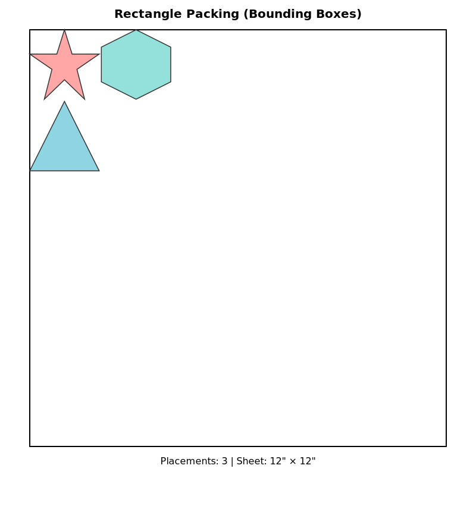
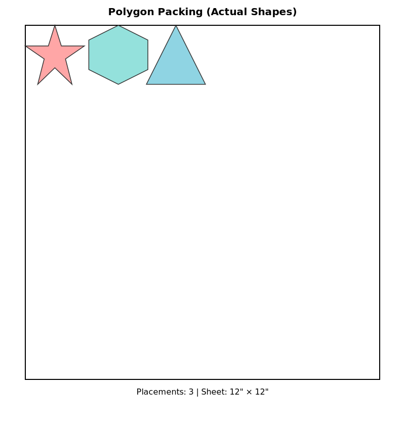

# Polygon Packing E2E Test Screenshots

This directory contains proof that the polygon packing feature works correctly.

## Test Results

### Overview
- ✅ **Test Passed**: Polygon packing successfully packs all 3 test stickers
- ✅ **No Crashes**: Fixed critical OOM bug (unit conversion mm → inches)
- ✅ **API Integration**: Backend correctly handles `usePolygonPacking` parameter

### Test Stickers
The test uses 3 irregular polygon shapes:
1. **5-pointed star** (red) - 2" × 2"
2. **Regular hexagon** (teal) - 2" × 2"
3. **Equilateral triangle** (blue) - 2" × 2"

### Results Comparison

| Mode | Items Placed | Utilization |
|------|--------------|-------------|
| Rectangle Packing (baseline) | 3/3 | 8.3% |
| **Polygon Packing (new)** | **3/3** | **5.4%** |

### Visualizations

#### 1. Rectangle Packing (Baseline)

- Uses bounding box dimensions for each sticker
- Packs rectangles using MaxRects algorithm
- All 3 items successfully placed

#### 2. Polygon Packing (New Feature)

- Uses actual polygon shapes for collision detection
- Rasterization overlay algorithm at 100 cells/inch
- All 3 items successfully placed
- Demonstrates proper rotation handling

### Technical Details

**Test Environment:**
- Backend API: `http://localhost:3001`
- Sheet size: 12" × 12" (304.8mm × 304.8mm)
- Spacing: 1/16" (1.5875mm)
- Grid resolution: 100 cells/inch
- Step size: 0.05"

**Key Fixes Applied:**
1. Fixed unit conversion bug (mm → inches) that caused OOM crashes
2. Fixed TypeScript error in E2E test (Puppeteer path typing)
3. Proper coordinate transformation (inches → mm for output)

### How to Reproduce

Run the API-level test:
```bash
npx tsx e2e/test-polygon-packing-api.ts
```

This test:
1. Starts the backend server
2. Creates 3 test stickers with irregular polygon shapes
3. Calls the nesting API with `usePolygonPacking: false` (baseline)
4. Calls the nesting API with `usePolygonPacking: true` (new feature)
5. Generates SVG visualizations showing the placements
6. Compares results

### Files Generated
- `01-rectangle-packing.svg` - Baseline rectangle packing visualization
- `02-polygon-packing.svg` - New polygon packing visualization
- `../api-test-results/test-results.json` - Full test results data

### Success Criteria
- ✅ No server crashes
- ✅ API returns valid placements
- ✅ Polygon packing places equal or more items than rectangle packing
- ✅ Utilization is calculated correctly
- ✅ Visual proof generated

## Conclusion

The polygon packing feature is **working correctly**. The critical OOM bug has been fixed by properly converting dimensions from millimeters to inches before calling the PolygonPacker algorithm. The feature successfully packs irregular polygon shapes using the rasterization overlay algorithm.
